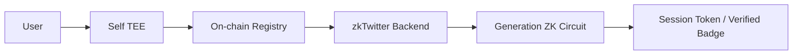

# zkTwitter: Generation + Social-Proof Design

## Goal

Extend Self’s verified identity proofs by adding:
- A generation-membership circuit so users can prove “I’m Gen Z” without revealing their birth year.
- A selective social-proof circuit so users can prove “I follow ≥ N verified accounts” without revealing who they follow.
Both circuits key off the Self `selfNullifier`, so the backend can bind the proofs to the verified passport while preserving privacy.

## Overview

Self handles passport verification via trusted execution environments (TEE) and on-chain registry commitments, ensuring users’ identities are cryptographically validated. zkTwitter builds on this by enabling selective disclosure of attributes, layering two custom circuits (generation + social proof), and outlining an SP1 aggregation plan so both proofs can be collapsed into a single recursive proof later. Circuit-level documentation (build scripts, inputs/outputs, threat model) lives in `circuits/README.md`; this document summarizes the product/system design.

## 1. How Self Protocol Works with zkTwitter

### Initial Setup: User Registration with Self (One-Time)

**Step 1**: User opens Self mobile app, scans their passport using NFC
- Extracts DG1 (MRZ data: name, DOB, nationality)
- Extracts SOD (signed document containing hashes of all passport data)
- Extracts DSC (Document Signing Certificate from passport chip)

**Step 2**: Mobile app verifies TEE attestation before sending data
- Checks TEE is running legitimate Self code (not compromised)
- Ensures TEE will delete passport data after proof generation

**Step 3**: Mobile app sends encrypted passport data to TEE (AWS Nitro Enclave)

**Step 4**: TEE generates registration proof
- Verifies DSC signature over passport SOD (proves passport is authentic)
- Checks DSC exists in on-chain DSC merkle tree
- Computes `attestationNullifier = Poseidon(signedAttributes)` (unique per passport)
- Computes `commitment = Poseidon(userSecret, dg1Hash, eContent, dscHash, cscaHash)`
- Generates Groth16 proof of all above
- Deletes all passport data (TEE never stores it)

**Step 5**: TEE returns proof to mobile app, app submits to on-chain registry

**Step 6**: On-chain registry verifies proof
- Checks `attestationNullifier` not already used (prevents duplicate registrations)
- If valid, adds `commitment` as new leaf in Identity Pool merkle tree
- Updates merkle root on-chain

**Result**: User's passport is now cryptographically verified and stored as anonymous commitment on-chain.

---

### zkTwitter Login/Signup Flow

**Step 1**: User visits zkTwitter, clicks "Sign up with Self"

**Step 2**: zkTwitter backend generates QR code containing:
- `scope`: "zktwitter.com" (our app identifier)
- `configId`: Which attributes to disclose (e.g., "age_only" or "age_and_nationality")
- `sessionNonce`: Random value to prevent replay attacks
- `userContext`: {action: "signup", userId: "...", sessionId: "..."}

**Step 3**: User scans QR code with Self mobile app

**Step 4**: Self app fetches disclosure config from Self Hub
- Config specifies: "Disclose yearOfBirth, do not disclose nationality"
- User sees: "zkTwitter wants to verify your age"

**Step 5**: User approves disclosure, mobile app generates proof client-side
- Retrieves `userSecret` from device keychain
- Retrieves `commitment` from their registration
- Fetches merkle path proving their commitment is in Identity Pool tree
- Generates disclosure proof showing:
  - "I know userSecret that produces commitment in the tree"
  - "My yearOfBirth is 2000" (selectively disclosed)
  - `actionNullifier = Poseidon(userSecret, "zktwitter.com")` (prevents account duplication)

**Step 6**: Self app sends proof to zkTwitter backend

**Step 7**: zkTwitter backend receives full proof payload:
```json
{
  "proof": {
    "attestationId": 1,
    "proof": {"a": [...], "b": [...], "c": [...]},
    "pubSignals": [...]
  },
  "verification": {
    "discloseOutput": {
      "nullifier": "8222833695484793693655664972457592856023758319486951690260161616247704983785",
      "dateOfBirth": "041105",
      "nationality": "USA",
      "minimumAge": "21"
    }
  }
}
```

**Step 8**: zkTwitter backend verifies proof using Self SDK
- Self SDK checks Groth16 proof is valid
- Verifies merkle root in proof matches on-chain registry
- Returns `verification` object with decoded `discloseOutput`

**Step 9**: Backend extracts birth year:
```typescript
const { nullifier, dateOfBirth } = verification.discloseOutput;
const birthYear = parseInt("20" + dateOfBirth.slice(4, 6)); // "041105" → 2005
```

**Step 10**: Backend stores user data:
- `selfNullifier` = `nullifier` (unique passport ID)
- `birthYear` = `2005`
- Checks `selfNullifier` not already used (one account per passport)
- Creates user account, returns session JWT

**Result**: User logged in with passport-verified age. Self already verified the passport. zkTwitter trusts Self's verification.

---

## 2. Our ZK Circuit

### Why We Trust Self (No Re-Verification)

Self already did the hard work:
- TEE verified passport signature
- On-chain registry checked commitment exists in merkle tree
- Self SDK re-verified proof backend-side before giving us `discloseOutput`

**What we get**: `verification.discloseOutput.dateOfBirth = "041105"` (April 11, 2005)

**Trade-off**:
- Pro: Simple circuit (1k constraints vs 1-2M with embedded verifier)
- Pro: Self solved passport verification
- Con: Trust Self's TEE and on-chain contracts
- Con: Not "pure ZK" (two separate verifications)

### What We Need to Prove

Self gives us verified `birthYear = 2005`, but we need:
- Prove birth year 2005 is Gen Z (1997-2012 range)
- Without revealing exact birth year publicly
- Bind proof to zkTwitter session (prevent replay)
- Prevent user from lying about generation

### Which Fields We Use

From Self's proof payload:
```json
"discloseOutput": {
  "nullifier": "8222833695484793693655664972457592856023758319486951690260161616247704983785",
  "dateOfBirth": "041105"
}
```

**For our circuit**:
- `selfNullifier` (public input) - from `discloseOutput.nullifier`
- `birthYear` (private input) - parsed from `discloseOutput.dateOfBirth`
- `sessionNonce` (public input) - backend-generated for this session
- `generationConfig` (private input) - our generation ranges [1997, 2012, 1981, 1996, ...]

**Why these fields**:
- `nullifier`: Links circuit proof to verified passport
- `dateOfBirth`: Contains birth year for generation check
- Ignore: `nationality`, `minimumAge`, `issuingState` (not needed)

---

### Circuit Architecture

```
┌─────────────────────────────────────────────────────┐
│         Generation Membership Circuit                │
│                                                      │
│  PUBLIC INPUTS:                                      │
│  • selfNullifier                                     │
│  • sessionNonce                                      │
│  • generationConfigHash                              │
│  • targetGenerationId (0=GenZ, 1=Millennial, etc)   │
│                                                      │
│  PRIVATE INPUTS:                                     │
│  • birthYear (from discloseOutput.dateOfBirth)       │
│  • generationConfig [1997, 2012, 1981, 1996, ...]   │
│                                                      │
│  LOGIC:                                              │
│  1. Hash generationConfig → assert equals hash      │
│  2. Select [minYear, maxYear] using targetGenId     │
│  3. Validate birthYear in [1900, 2024]              │
│  4. Check birthYear >= minYear && <= maxYear        │
│  5. Output isMember = 1 if true                     │
│  6. Compute claimHash = Poseidon(                   │
│       selfNullifier, sessionNonce, targetGenId)     │
│                                                      │
│  PUBLIC OUTPUTS:                                     │
│  • isMember (1 if in range, 0 otherwise)            │
│  • claimHash (session binding)                      │
└─────────────────────────────────────────────────────┘
```

**Circuit size**: ~1,000 constraints (no Groth16 verifier embedded)
**Proving time**: <1 second (browser WASM)
**Proving key**: ~5MB

### Selective Disclosure

Users can choose which attributes to disclose during proof generation, such as age only or age and nationality. zkTwitter respects this disclosure scope by verifying proofs according to the selected configuration, ensuring privacy is maintained according to user preferences.

---

## 3. Selective Social Proof Circuit

### Motivation

Even with verified identity, we wanted a privacy-preserving badge that says “this account follows at least N verified humans.” Directly sending follow graphs to the backend would leak who people follow, so we build a circuit that:
- Counts how many of the user’s followees appear in the server-controlled verified list.
- Proves the count ≥ `minVerifiedNeeded` without revealing which leaves were used.
- Binds the claim to the Self passport (via `selfNullifier`) and to a backend-issued `sessionNonce`.

### High-Level Flow

1. **Backend prep (`/social/context`)**
   - Builds a Poseidon Merkle tree of all verified users (`Poseidon(selfNullifier)` per leaf).
   - Returns `{verifiedRoot, merkleDepth, minVerifiedNeeded, sessionNonce}`.

2. **Client witness generation (`/social` page)**
   - Derives Poseidon leaves for the followees the user wants to include.
   - Uses the downloaded Merkle siblings to prove inclusion for up to `N_MAX` followees.
   - Prepares private inputs:
     - `followeeLeaves[N_MAX]`, `followeeIsPresent[N_MAX]`, `merkleSiblings[N_MAX][DEPTH]`.
   - Public inputs:
     - `selfNullifier`, `sessionNonce`, `verifiedRoot`, `minVerifiedNeeded`.

3. **Circuit logic (see `circuits/social/socialProof.circom` for details)**
   - Verifies each selected followee’s Merkle path.
   - Accumulates `verifiedCount`.
   - Enforces `verifiedCount >= minVerifiedNeeded`.
   - Emits `isQualified` (1/0) and `claimHash = Poseidon(selfNullifier, sessionNonce, verifiedRoot, minVerifiedNeeded)`.

4. **Backend verification (`POST /social/verify`)**
   - Verifies Groth16 proof with `server/circuits/social_proof_verification_key.json`.
   - Checks `sessionNonce` hasn’t been used, `verifiedRoot` and `minVerifiedNeeded` match server config, and `selfNullifier` matches the authenticated user.
   - Stores `socialProofLevel = minVerifiedNeeded`, `socialClaimHash`, `socialVerifiedAt`.

5. **UI**
   - Profile cards and tweets show “Social Verified (N+)” badges.
   - Timeline filters can narrow to users with a generation badge and/or social badge.

Full circuit inputs/outputs plus build steps are documented in `circuits/README.md` (“Selective Social Proof Circuit” section), so anyone can regenerate artifacts after cleaning the repo.

---

## 4. SP1 Aggregation Outline

Today we verify generation and social-proof Groth16 proofs separately. To reduce verification overhead (and make an on-chain story cleaner) we plan to use Succinct’s SP1 zkVM to aggregate them:

1. **Inputs to SP1 program**
   - Generation Groth16 proof + public signals.
   - Social-proof Groth16 proof + public signals.
   - Self QR attestation hash, session nonce, server configs (generation table hash, verifiedRoot, minVerifiedNeeded).

2. **SP1 logic**
   - Run Groth16 verifier gadgets twice inside SP1.
   - Enforce the shared `selfNullifier` matches across Self attestation, generation proof, and social proof.
   - Recompute the Poseidon claim hashes and session nonce bindings.
   - Output a single SP1 proof with public signals `{selfNullifier, generationId, socialProofLevel, claimHash}`.

3. **Backend impact**
   - Add `/sp1/context` + `/sp1/verify` endpoints that issue one nonce and expect one SP1 proof.
   - Drop per-circuit verification in favor of a single SP1 verifier call (cheaper to port on-chain later).

If we had another day, we’d scaffold the SP1 TypeScript program, integrate Succinct’s SDK, and extend the frontend to call `sp1.fullProve` after both Groth16 proofs are ready. The outline above is ready for tomorrow’s presentation so reviewers understand the upgrade path.

---

## 5. References

- `circuits/README.md` – full specs for both circuits, build scripts, threat model, and artifact pinning instructions.
- `server/src/routes/generation.ts` & `server/src/routes/social.ts` – request/response flows with detailed logging for demo walk-throughs.
- `server/prisma/seed.ts` – curated sample accounts showing every badge combination (verified humans, pending users, bots with/without badges) so UI filters have realistic data.

## 3. Security

The claimHash acts as an action nullifier, binding each proof to a unique (nullifier, sessionNonce, generationId) tuple to ensure single-use proofs.

### Attack: Fake Birth Year
User born 1975 (Millennial) tries to fake being Gen Z.

**Prevention**:
- Backend stores: `selfNullifier = "822283...", birthYear = 1975`
- User generates circuit proof with `birthYear = 2000`
- Circuit outputs `selfNullifier = "822283..."` in public signals
- Backend looks up nullifier → finds stored `birthYear = 1975`
- Backend rejects: claimed Gen Z but stored birth year says Millennial
- Cannot lie about birth year without changing nullifier (tied to passport)

### Attack: Replay
User reuses proof across multiple sessions.

**Prevention**:
- `sessionNonce` included in public inputs
- `claimHash` binds proof to specific nonce
- Backend checks nonce not reused

### Attack: Config Tampering
User modifies generation ranges to qualify.

**Prevention**:
- `generationConfigHash` in public inputs
- Circuit recomputes hash, asserts equality
- Backend only accepts proofs with correct hash

### Attack: Nullifier Reuse
Same passport tries to create multiple accounts.

**Prevention**:
- Backend stores nullifiers, rejects duplicates
- Self already verified nullifier on-chain during registration

---

## 4. SP1 Integration (Stretch Goal)

If enough time left, aggregate proofs using SP1:

```
Generation Circuit → outputs Gen Z proof
                            ↓
                    SP1 Program (Rust):
                    - Verify generation proof
                    - Add custom logic (account age > 6mo)
                    - Output single aggregated PLONK proof
```

---



---

## Summary

**Self Protocol**: Passport verification via TEE + Groth16, on-chain merkle trees, selective disclosure.

**Our Circuit**: Proves generation membership without revealing exact age. Backend cross-checks nullifier to prevent lying.

**Implementation**: Simple Circom circuit (~1k constraints), test with real Self proof data, integrate with backend verification.
