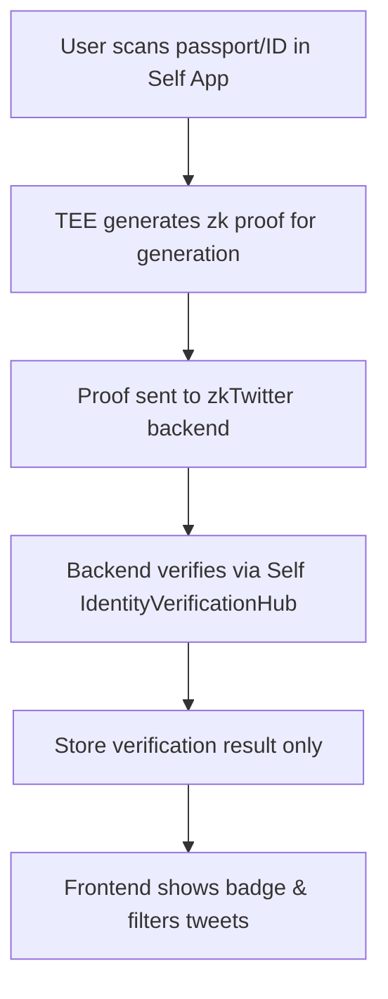

# zkTwitter: Generation Filter Feature (ZK Circuits)

## Feature Overview
Enable users to prove their generational group (e.g., Gen Z, Boomer) using privacy-preserving zero-knowledge proofs, without revealing their exact birth date or personal details. This allows zkTwitter to filter content and grant access based on verified generation, while keeping user data private.

## How It Works
- **Identity Verification:** Uses Self Protocol’s mobile app and backend to verify user identity and age via passport/ID scan.
- **Zero-Knowledge Proofs:** Self’s TEE generates a zk proof that the user meets the age criteria for a generation (e.g., born after 1997 for Gen Z).
- **Configurable Rules:** Generation groups are defined in Self’s verification config (e.g., Gen Z, Boomer, Millennial) using age thresholds.
- **Backend Verification:** zkTwitter backend submits the proof to Self’s IdentityVerificationHub V2, which verifies the proof and returns structured results.
- **Frontend Filtering:** The app displays generation badges and filters tweets based on verified group membership.
- **SP1 zkVM:** For future upgrades, proofs can be aggregated or re-verified using Succinct’s SP1 zkVM for advanced privacy and composability.

## Data Flow

### What Gets Stored Where
- **Self Protocol:** Stores encrypted identity data (passport/ID) in TEE. Never shares raw birth date or personal info.
- **zkTwitter Backend:** Only stores verification result (e.g., "user is Gen Z: true") and proof hash. No birth dates, no personal data.
- **User's Device:** Temporarily holds the zk proof during verification handshake. Proof is discarded after verification.

### Verification Flow
1. User opens Self app, scans passport/ID (one-time setup)
2. Self's TEE generates a zk proof: "This person was born after 1997" (no exact date revealed)
3. User initiates verification in zkTwitter app
4. zkTwitter backend receives proof → sends to Self's IdentityVerificationHub V2
5. Hub verifies proof cryptographically, returns: `{ generation: "Gen Z", verified: true }`
6. Backend stores result in DB, returns JWT to frontend
7. Frontend shows Gen Z badge, filters tweets accordingly

### Privacy Guarantees
- Self never knows you're using zkTwitter (just verifies the proof math checks out)
- zkTwitter never sees your birth date, passport, or ID details
- Other users only see your generation badge, nothing else

## Architecture Diagram

## Implementation Steps
1. Define generation configs in Self (e.g., Gen Z: 1997-2012, Millennial: 1981-1996, Boomer: 1946-1964).
2. Integrate Self mobile app for user proof generation.
3. Connect backend to Self's IdentityVerificationHub for proof verification.
4. Filter content and display badges in frontend based on verification results.
5. **(Optional) SP1 zkVM Integration:** If we have time, use SP1 to aggregate multiple proofs or add custom logic (e.g., "verify Gen Z + account age > 6 months") without revealing underlying data.

## SP1 zkVM Integration (If Time Permits)

### Why SP1?
- **Proof Aggregation:** Combine multiple Self proofs (generation + location + account age) into one compact proof
- **Custom Logic:** Write Rust circuits that run inside SP1 to add app-specific rules (example, "Gen Z user who joined before 2024")
- **Verify** Proof somehow(tricky imo as self verifier is diff from sp1). I think we will need to verify self proof first then generate sp1 proof of that verification is best approach. But open to new ideas.

### How It'd Work
1. User gets initial proof from Self (generation verified)
2. zkTwitter backend feeds Self proof + additional context into SP1 program
3. SP1 zkVM runs Rust circuit that checks: "user is Gen Z AND meets app-specific criteria"
4. Output: Single aggregated proof that Self + zkTwitter can verify independently
5. Store SP1 proof hash, use it for cross-app reputation or on-chain verification later

### What We'd Need
- SP1 SDK (install via `cargo install sp1-cli`)
- Write a simple Rust program that takes Self proof as input, adds our logic
- Deploy SP1 verifier (either on-chain or as a microservice)
- Fallback to Self-only verification if SP1 isn't ready